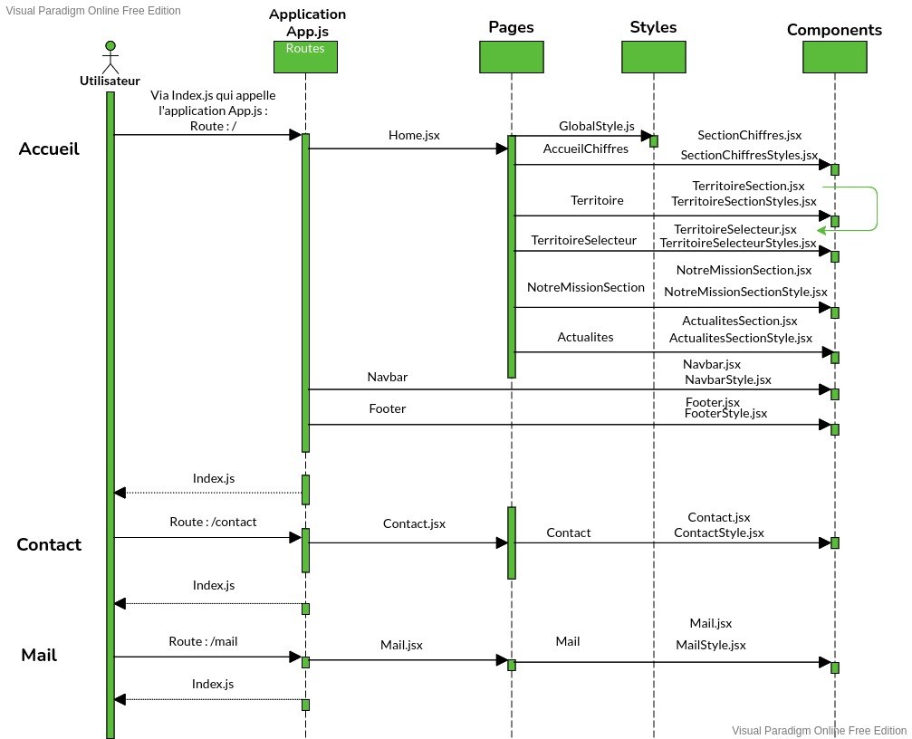
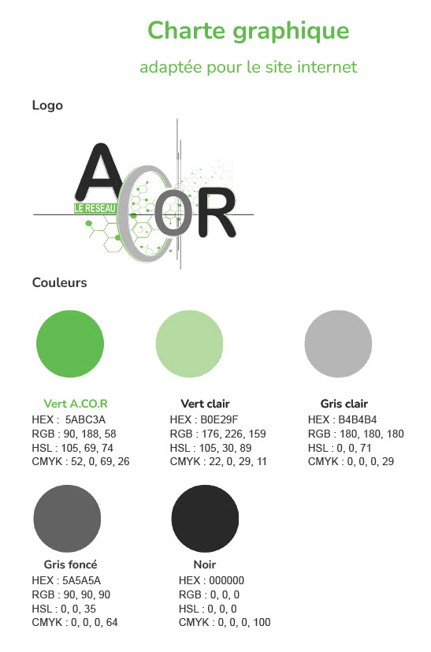
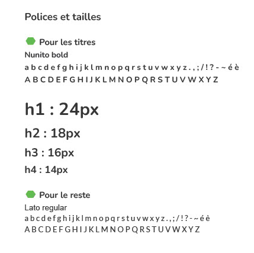

# A.CO.R La React Web App
#### <i>La notice</i>

#### 1) Créer une application

    npx create-react-app acorapp

#### 2) Suppression des fichiers inutiles de l'application

Tout ce qui est fichiers liés à Webvitalis, test, styles par défaut

#### 3) Démarrer l'application acor

    npm start

#### 4) Diagramme de séquence qui explique le fonctionnement de l'application

#### 5) Charte graphique

#### 6) Versions

ReactJS : 18.1
NPM utilisé en développement : 8.11
React-router-dom : 6.3
Styled Components : 5.3.5
React Hook Form : 7.30
React-icons : 4.3.1 

#### 4) Liens

Maquette sur Figma : https://www.figma.com/file/qArBGRqGnnhNorsHlOeFGM/Site-Internet-A.CO.R
Repository Github version test : https://github.com/koloos/firsttestswitch_acor
Site officiel ReactJS : https://fr.reactjs.org/docs/getting-started.html
Site officiel Npm : https://docs.npmjs.com/
Site officiel Styled Components : https://styled-components.com/docs
Site officiel React Hook Form : https://react-hook-form.com/get-started
Site officiel EmailJS : https://www.emailjs.com/docs/

